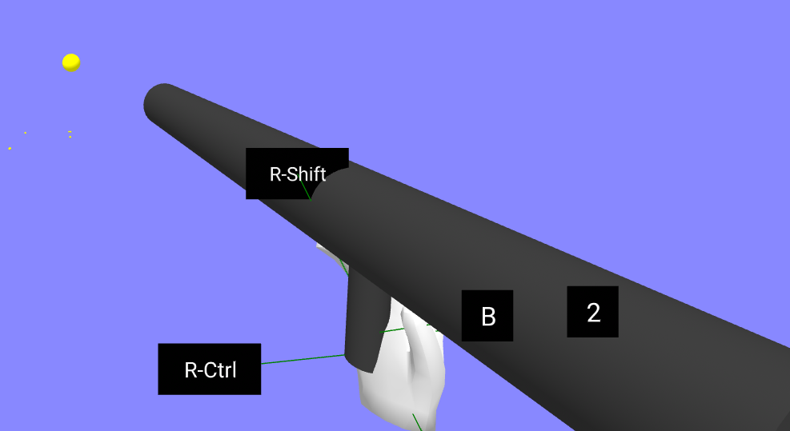

## Overview

A simple gun that blasts small yellow balls.  Useful for testing / demoing physics scenes.

Compatible with:

- [aframe-physics-system](https://github.com/c-frame/aframe-physics-system) (Cannon & Ammo drivers)
- [physx for A-Frame](https://github.com/c-frame/physx) 




Two components are provided, both with the same schema:

- `ball-blaster` intended for use directly in a scene
- `controller-ball-blaster` intended for use as a child of a controller.  This component includes some additional functionality to appear when the controller is instantiated (e.g. on entering VR) and disappear when the controller disappears (e.g. on exiting VR)

## Schema

Both components have the same schema:


| Property     | Description                                                  | Default          |
| ------------ | ------------------------------------------------------------ | ---------------- |
| velocity     | Velocity of balls in m/s                                     | 20               |
| radius       | Radius of balls, in m                                        | 0.05             |
| ballColor    | The color of the balls                                       | yellow           |
| blasterColor | The color of the blaster                                     | #333 (dark grey) |
| debug        | Enables detailed console logging of ball speed and position, useful for debugging issues | false            |

 The components automatically detects any supported physics system configured on the scene, and applies appropriate physics configuration.

When PhysX is used, Continuous Collision Detection is configured (this is unsupported in Cannon and Ammo).

## Usage

A blaster that shoots slow balls (1m/s)

```
<a-entity position='-0.5 1.5 -1' rotation='20 -20 0' ball-blaster="velocity: 1">
</a-entity>
```


A blaster held in a player's right hand (with `desktop-vr-controller` simulation of the hand when running on desktop).

```
      <a-entity id="right-hand"
                hand-controls="hand: right" 
                position="0.4 1.4 -0.5"
                rotation="45 0 0"
                desktop-vr-controller>
        <a-entity controller-ball-blaster rotation="-80 0 0" position="-0.02 0 -0.01"></a-entity>
      </a-entity>
```


## Installation

Via CDN 
```
<script src="https://cdn.jsdelivr.net/npm/aframe-ball-blaster@0.0.1/index.min.js"></script>
```

Or via [npm](https://www.npmjs.com/package/aframe-polygon-wireframe)

```
npm install aframe-ball-blaster
```


## Examples

This component is used in tests for the `xr-room-physics` component, for example:

[ammo-desktop-room5.html](https://diarmidmackenzie.github.io/aframe-components/components/xr-room-physics/test/ammo-desktop-room5.html)

See also tests for each supported physics engine:

[ammo-blaster.html](https://diarmidmackenzie.github.io/aframe-components/components/ball-blaster/test/ammo-blaster.html)

[cannon-blaster.html](https://diarmidmackenzie.github.io/aframe-components/components/ball-blaster/test/cannon-blaster.html)

[physx-blaster.html](https://diarmidmackenzie.github.io/aframe-components/components/ball-blaster/test/physx-blaster.html)


## Futures

At some point I would like to add the following (PRs welcome!)

- sound effects when projectiles collide with other entities

- haptic feedback when shooting in VR

  

## Code

  [ball-blaster](https://github.com/diarmidmackenzie/aframe-components/blob/main/components/ball-blaster/index.js)

