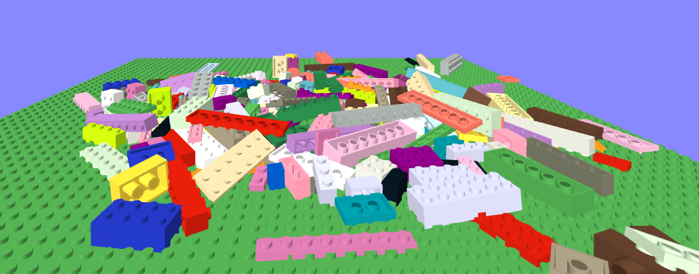
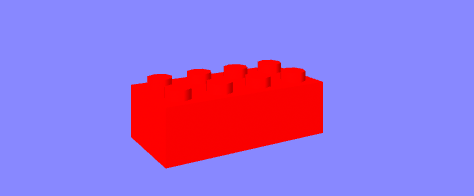
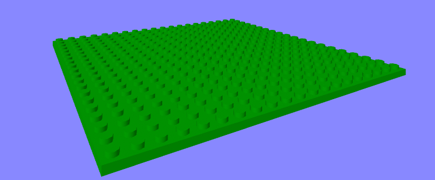

# bricks

Building brick entities in A-Frame, pre-integrated with PhysX physics.



This is a work-in-progress.

- Manipulation and snapping together of bricks is implemented (with a few bugs still to iron out), but not yet integrated with physics.  So you can have physics or manipulation & snapping together of bricks, but not both.


## Schema

### brick

| Property          | Description                                                  | Default |
| ----------------- | ------------------------------------------------------------ | ------- |
| width             | The width of the brick, in studs.                            | 4       |
| depth             | The depth of the brick, in studs                             | 2       |
| height            | The height of the brick, in plates.  A plate has height 1, a standard brick has height 3. | 3       |
| cylinder-segments | How many segments to use in the cylinder geometries for the studs, and pipes underneath the brick.  More segments results in a more circular appearance,  but at a performance cost, as more triangles have to be rendered. | 8       |
| movement          | One of: static, dynamic or kinematic.  This determines the type of `physx-body` configured on the brick in the physics engine.  See [physx documentation](https://github.com/c-frame/physx#component-physx-body) for more detail. | dynamic |
| color             | The color of the brick                                       | red     |

Here is what the [default brick](https://diarmidmackenzie.github.io/aframe-components/component-usage/bricks/single.html), looks like:



Explore all the options [here](https://diarmidmackenzie.github.io/aframe-components/component-usage/bricks/flexible.html).

### a-brick

An `<a-brick>` primitive is also provided.  The properties are identical to those on the `brick` component above.


[Here's a base plate](https://diarmidmackenzie.github.io/aframe-components/component-usage/bricks/single-alt.html), which can be created like this:

```
<a-brick width="20" depth="20" height="1" color="green"></a-brick>
```




## Installation

```
<script src="https://cdn.jsdelivr.net/gh/diarmidmackenzie/aframe-components@main/components/bricks/index.js"></script>
```

To use physics in the scene, you should also include PhysX:

```
<script src="https://cdn.jsdelivr.net/gh/c-frame/physx@latest/dist/physx.min.js"></script>
```

(check [PhysX docs](https://github.com/c-frame/physx#installation) for up-to-date installation guidance)


## Examples

[brick-viewer](https://diarmidmackenzie.github.io/aframe-components/component-usage/bricks/flexible.html) - experiment with the various options for a single brick

[falling bricks](https://diarmidmackenzie.github.io/aframe-components/component-usage/bricks/falling.html) - a stream of bricks fall onto a static base plate

[wall](https://diarmidmackenzie.github.io/aframe-components/component-usage/bricks/wall.html) - this example is a work-in-progress (or perhaps a "disproof of concept" :-).  Bricks are joined using PhysX fixed joints, but these are not rigid enough and lead to the wall bowing when above about 7 bricks in height.  My plan is to replace fixed joints by using a "single actor with multiple shapes" to model the physics for a set of bricks joined together in a fixed manner, as per the docs [here](https://gameworksdocs.nvidia.com/PhysX/4.1/documentation/physxguide/Manual/Joints.html#fixed-joint), but this is quite a substantial change!

[snapping](https://diarmidmackenzie.github.io/aframe-components/component-usage/bricks/snapping.html) - moveable, snappable bricks.  This example uses the [`dynamic-snap` component ](https://diarmidmackenzie.github.io/aframe-components/components/dynamic-snap) and the [`plug-socket` system](https://diarmidmackenzie.github.io/aframe-components/components/plug-socket ) to support snapping bricks together, under control of either [mouse](https://diarmidmackenzie.github.io/aframe-components/components/mouse-manipulation) or [laser](https://diarmidmackenzie.github.io/aframe-components/components/laser-manipulation) controls.  No physics / gravity / collision detection yet (so unbound blocks levitate where they are left, and bricks can overlap each other), and a few minor bugs with positioning that still need ironing out.

See also: [tests](https://diarmidmackenzie.github.io/aframe-components/components/bricks/test/)

## Code

[bricks](https://github.com/diarmidmackenzie/aframe-components/blob/main/components/bricks/index.js)