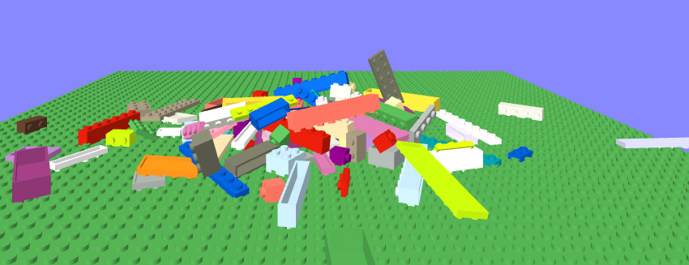

## bricks

Building brick entities in A-Frame, pre-integrated with PhysX physics.



This is a work-in-progress.  Manipulation and joining together of bricks is not yet implemented.

Underside detail of bricks is also not yet implemented.


## Schema

### brick

| Property | Description                                                  | Default |
| -------- | ------------------------------------------------------------ | ------- |
| width    | The width of the brick, in studs.                            | 4       |
| depth    | The depth of the brick, in studs                             | 2       |
| height   | The height of the brick, in plates.  A plate has height 1, a standard brick has height 3. | 3       |
| movement | One of: static, dynamic or kinematic.  This determines the type of `physx-body` configured on the brick in the physics engine.  See [physx documentation](https://github.com/c-frame/physx#component-physx-body) for more detail. | dynamic |
| color    | The color of the brick                                       | red     |

Here is what the [default brick](https://diarmidmackenzie.github.io/aframe-components/component-usage/bricks/single.html), looks like:


### a-brick

An `<a-brick>` primitive is also provided.  The properties are identical to those on the `brick` component above.


[Here's a base plate](https://diarmidmackenzie.github.io/aframe-components/component-usage/bricks/single-alt.html), which can be created like this:

```
<a-brick width="20" depth="20" height="1" color="green"></a-brick>
```


## Installation

```
<script src="https://cdn.jsdelivr.net/npm/aframe-connecting-line@0.1.0/bricks.min.js"></script>
```

To use physics in the scene, you should also include PhysX:

```
<script src="https://cdn.jsdelivr.net/gh/c-frame/physx@latest/dist/physx.min.js"></script>
```

(check [PhysX docs](https://github.com/c-frame/physx#installation) for up-to-date installation guidance)


## Examples

[falling bricks](https://diarmidmackenzie.github.io/aframe-components/component-usage/bricks/falling.html) - a stream of bricks fall onto a static base plate


[wall](https://diarmidmackenzie.github.io/aframe-components/component-usage/bricks/wall.html) - this example is a work in progress.  Currently bricks are joined using PhysX fixed joints, but these are not rigid enough an lead to the wall bowing when above about 7 bricks in height.  Plan is to replace fixed joints by using a "single actor with multiple shapes" to model the physics for a set of bricks joined together in a fixed manner, as per the docs [here](https://gameworksdocs.nvidia.com/PhysX/4.1/documentation/physxguide/Manual/Joints.html#fixed-joint).


## Code

[bricks](https://github.com/diarmidmackenzie/aframe-components/blob/main/components/bricks/index.js)