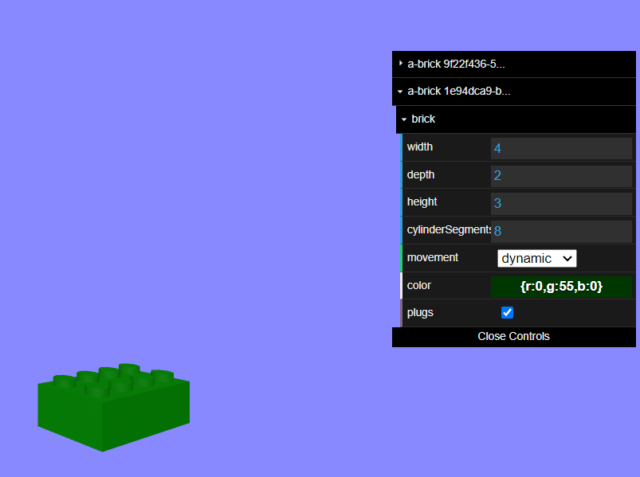
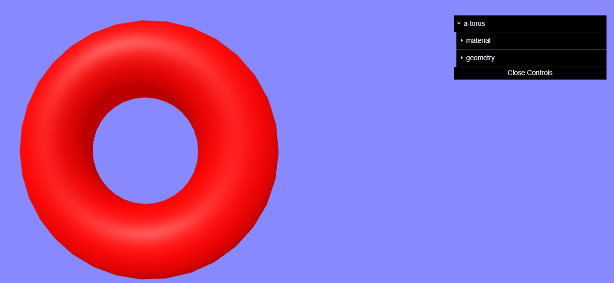

# dat-gui component

## Overview

You may be familiar with `dat.GUI` from the THREE.js documentation, for example pages like this:
[https://threejs.org/docs/index.html#api/en/geometries/BoxGeometry](https://threejs.org/docs/index.html#api/en/geometries/BoxGeometry)

This component dynamically creates a `dat.GUI` panel to view and adjust the properties of all components on an A-Frame entity, like this:



There are some limitations (see below), but for the most part, this should just work for any A-Frame entity & component.  It is a bit like [A-Frame inspector](https://aframe.io/docs/1.5.0/introduction/visual-inspector-and-dev-tools.html#a-frame-inspector), but doesn't require pausing the scene, and allows you to focus on just a few specific entities.


## Schema

This component currently has no schema.

In future we may offer a schema to filter in/out specific components/properties, or control the appearance of the `dat.GUI` panel.

## Installation

Via CDN 

```
<script src="https://cdn.jsdelivr.net/npm/aframe-dat-gui@0.0.1/dist/dat-gui.min.js"></script>
```

Or via [npm](https://www.npmjs.com/package/aframe-dat-gui)

```
npm install aframe-dat-gui
```


## Usage

Just add the `dat-gui` component to any entity, to display an entity's components and settings.

For example, this...

```
<a-torus color="red" dat-gui></a-torus>
```

... will result in a panel like this appearing in the top right of the screen.




You can add the `dat-gui` component to multiple entities in the scene, and each will appear as a collapsible folder in the `dat.GUI` panel.


## Limitations

At this point, there are quite a few limitations.  Requests, feedback and PRs are welcome.

- Testing & usage so far is limited, so early users may run into problems.  No isolation of errors, so if it hits a bug, there's a fair chance it will crash the whole scene.
- The `dat-gui` component checks which components and properties exist when it is initialized.  It doesn't check again.  You can force a refresh by removing and re-adding the component, but there's no  auto-refresh, and no way to refresh through the UI yet.
- Support for schema extension is limited.  There is support for the different properties associated with different geometry primitives.  There is no support for additional `material` properties associated with different shaders.
- No support yet for ranges (min & max values on properties)
- Currently supported schema types are: boolean, color, int, number, string, vec2, vec3, vec4, selector
- No support yet for arrays, selectorAll, assets and related (map, model, audio).
- No control for position / styling of `dat.GUI` panel.  Some of this can probably be done using CSS, but I haven't looked at how to best do that yet.
- When the panel fills the screen, there is a scroll bar, but the `Close controls` button is awkwardly placed, often blocking one of the properties.  Seems like a `dat.GUI` bug, but perhaps I'm doing something wrong here...
- This only works in desktop mode, not in AR/VR.  There has been some work to provide similar functionality to`dat.GUI` in VR in the past, see [here](https://discourse.threejs.org/t/dat-gui-for-webxr/21906/5) and [here](https://github.com/dataarts/dat.guiVR), but nothing alive at the moment.
- In theory, it should be possible to bring up a `dat.GUI` control panel for entities dynamically when selected with a mouse pointer (using raycasting/cursor).  This would be a nice example/demo to build, but I didn't get to it yet.

## Examples

[Torus example](https://diarmidmackenzie.github.io/aframe-components/component-usage/dat-gui/torus.html)

Also more examples in the `\tests\` folder.

## Code

  [dat-gui](https://github.com/diarmidmackenzie/aframe-components/blob/main/components/dat-gui/index.js)