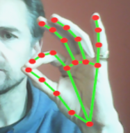
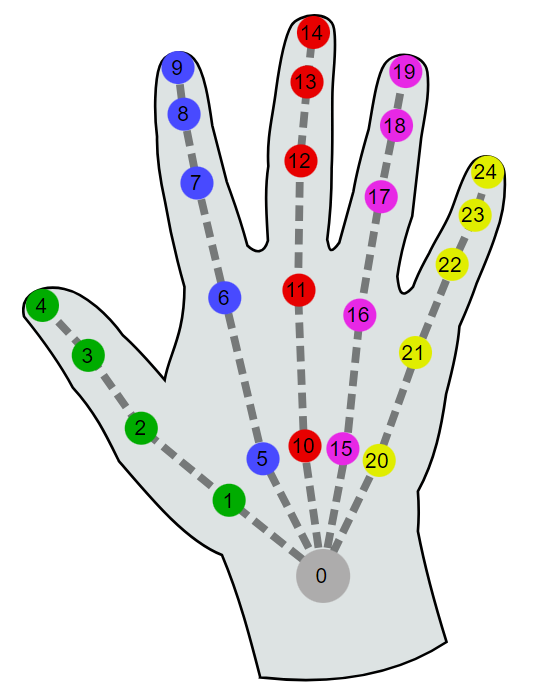

# desktop-xr-hands

## Overview

Simulates WebXR Hand Tracking on desktop, using Mediapipe + Webcam.


## Schema

### system

The following properties can be set on the `<a-scene>` like this:

```
<a-scene desktop-xr-hands="cameraFov: 50; zOffset: 2"></a-scene>
```

| Property  | Description                                                  | Default |
| --------- | ------------------------------------------------------------ | ------- |
| cameraFov | fov (width) of the webcam.  Used in computing distance of hands from the camera. | 60      |
| zOffset   | z offset at which to render the hands.   Hands will be level with the scene camera when they are approximately this distance from the webcam. | 1       |

### per-hand

There are currently no configurable properties per-hand.  However it is essential to include the `desktop-xr-hands` component on any entity that makes use of the WebXR Hand Tracking API.


## Installation

```
<script src="https://cdn.jsdelivr.net/npm/aframe-desktop-xr-hands@0.0.1/dist/desktop-xr-hands.min.js"></script>
```

Or via [npm](https://www.npmjs.com/package/aframe-desktop-xr-hands)

```
npm install aframe-desktop-xr-hands
```

then in your code...

```
if (!AFRAME.components['desktop-xr-hands']) require('aframe-desktop-xr-hands')
```

(the `if` test avoids conflicts with other npm packages that may also use `aframe-desktop-xr-hands`)


## Usage

Add the `desktop-xr-hands` attribute to any entity that uses `hand-tracking-controls`, or any other component that uses the WebXR Hand Tracking API (e.g. `aframe-handy-controls`).

The `desktop-xr-hands` attribute must be set on the entity *before* the component that uses the WebXR Hand Tracking API.

E.g.

```
<a-entity desktop-xr-hands hand-tracking-controls="hand: left"></a-entity>
```


## Examples

[desktop-xr-hands.html](https://diarmidmackenzie.github.io/aframe-components/component-usage/desktop-xr-hands/aframe-example.html) - The A-Frame Showcase Web XR Hand Tracking Example, with `desktop-xr-hands` added.

See also:

- [Simple test page with mesh hand model](https://diarmidmackenzie.github.io/aframe-components/compo- nents/desktop-xr-hands/test/mesh.html)

- [Simple test page with dots hand model](https://diarmidmackenzie.github.io/aframe-components/components/desktop-xr-hands/test/dots.html)


## Code

  [desktop-xr-hands](https://github.com/diarmidmackenzie/aframe-components/blob/main/components/desktop-xr-hands/index.js)


## Limitations / Futures

This is an experimental component, with limited testing so far, and plenty of limitations, including:

- Not possible to enable for just one hand in a scene
- No option to toggle video feed & overlay on/off or control size / position
- No variation in reported radii of joints - all reported as a fixed 1cm.
- Mapping for Mediapipe Hand Model to WebXR Hand Model is not perfect, can probably be improved.
- Hands are positioned in world space, relative to an assumed camera position of (0, 1.6, 0).  If the camera is moved, hands don't move with it.
- Gesture detection is untested.  Looking at Mediapipe fingertip positions for a pinch, it looks as though there could be precision issues with getting a reliable pinch.
  

- Only tested with A-Frame `hand-tracking-controls` so far.  Would be nice to test with other hand tracking component systems, e.g. [`hand-tracking-controls-extras`](https://github.com/gftruj/aframe-hand-tracking-controls-extras) and [`handy-work`](https://github.com/AdaRoseCannon/handy-work/blob/main/README-AFRAME.md).
- Most of the code in these components is not A-Frame-specific.  Would be nice (and probably not too hard?) to abstract the code so it can be framework-agnostic and work with any THREE.js app, Babylon etc.

PRs for any of the above would be welcome!


## References

Mediapipe reports positions for the following hand landmarks:


[source](https://developers.google.com/mediapipe/solutions/vision/hand_landmarker)


The WebXR API has to report positions & orientations for the following joints:



[source](https://www.w3.org/TR/webxr-hand-input-1/#skeleton-joints-section)

`desktop-xr-hands` takes care of mapping Mediapipe reported positions, to WebXR API positions and orientations.