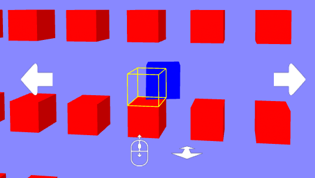

# dynamic-snap component


## Overview

[mouseManipulation]: https://diarmidmackenzie.github.io/aframe-components/components/mouse-manipulation/
[laserManipulation]: https://diarmidmackenzie.github.io/aframe-components/components/mouse-manipulation/
[animation]: https://aframe.io/docs/1.4.0/components/animation.html
[physicsSystems]: https://aframe.wiki/en/#!pages/physics.md
[snapToGrid]: https://github.com/diarmidmackenzie/aframe-components/tree/main/components/dynamic-snap/test/snap-to-grid.js
[plugSocket]: https://diarmidmackenzie.github.io/aframe-components/components/plug-socket/


A component to dynamically snap to positions.

This works in combination with additional components such as `snap-to-grid` or `plug-socket`, which provide information as to positions are snappable to.




## Usage


Add the `dynamic-snap` component to an entity like this:

```
          <a-box position = "0 1.5 0"
                snap-to-grid
                dynamic-snap>
          <a-box>
```

You will also need to specify a component that implements the snap-position interface, such as  [`snap-to-grid`][snapToGrid]  or [`plug-socket`][plugSocket].  
You will need to implement some way to move the entity, for example the [`animation`][animation] component, a [physics engine][physicsSystems], or a manipulation component such as [`mouse-manipulation`][mouseManipulation] or [`laser-manipulation`][laserManipulation].

## Schema

| Property       | Type   | Description                                                  | Default        |
| -------------- | ------ | ------------------------------------------------------------ | -------------- |
| divergeEvent   | string | An event that triggers the phase in which the object can diverge into two entities: one with the object's actual precise position, the other that is free to snap to nearby positions. | 'mouseGrab'    |
| convergeEvent  | string | An event that triggers the object to snap to a position.     | 'mouseRelease' |
| renderSnap     | string | The rendering mode for the snap position of the object.  One of: object, wireframe, transparent, none. | 'transparent'  |
| renderPrecise  | string | The rendering mode for the precise position of the object (when in diverged state).  One of: object, wireframe, transparent, none. | 'object'       |
| wireframeColor | color  | The color to use for 'wireframe' rendering (if used).    Only one color is supported, even if both renderSmnap & renderPrecise use 'wireframe' rendering. | yellow         |
| opacity        | number | A value between 0 and 1.  The opacity to use for 'transparent' rendering (if used).  Only one value is supported, even if both renderSmnap & renderPrecise use 'transparent' rendering. |                |


## Interfaces

The `dynamic-snap` component has two interfaces:

- the movement interface controls the movement of the entity using `dynamic-snap`, and switching between "converged" and "diverged" modes

- the snap position interface provides information about which position should be snapped to, when appropriate.

  

### Movement Interface

Movement of the entity that uses `dynamic-snap`is handled in the usual way, by directly modifying object3D position, rotation etc.  (or by modifying the transform of a parent of the entity).  In diverged mode, this results in manipulation of the 'precise' position.

This means that the movement interface can be driven by controller components such as [`mouse-manipulation`][mouseManipulation] or [`laser-manipulation`][laserManipulation], and can also be driven by components such as [`animation`][aimation], or by a [physics engine][physicsSystems].

The movement interface also requires two events, one that indicates a switch into 'diverged' mode, where the entity shows both a 'precise' position and a 'snap position' (if one is available), and 'converged' mode, which triggers the entity to jump to the snap position, if one is available.

These are simple events, with no additional detail required.  They should be detectable on the entity that uses `dynamic-snap`.  The names of the events to use are configurable on the `dynamic-snap` component.

### Snap Position Interface

The Snap Position Interface is implemented by partner components such as  [`snap-to-grid`][snapToGrid]  or [`plug-socket`][plugSocket]

It uses three events: `snapStart`, `snapEnd` and `snappedTo`


| Event     | Emitted by        | Consumed by       | Description                                                  |
| --------- | ----------------- | ----------------- | ------------------------------------------------------------ |
| snapStart | partner component | dynamic-snap      | Indicates that the entity has reached a position where it could snap to a particular position.  Event detail contains a single property, `worldTransform`.  This is a THREE.js `Object3D`, with `position`, `quaternion` and `scale` set to the world transform of the snap position.  This `Object3D` does not need to be placed within the scene graph (it's just used as a convenient way to represent a transform).<br /><br />Note that each `snapStart` event implicitly overrides any previous `snapStart` event, so it is legal to send multiple `snapStart` events without `snapEnd` events in between |
| snapEnd   | partner component | dynamic-snap      | Indicates that the entity is now in a position where it would not snap to any position.  No event detail. |
| snappedTo | dynamic-snap      | partner component | Indicates that the entity has snapped to the transform indicated by the most recent `snapStart`event.  No event detail. |

For a simple example (which just generates `snapStart` events), see the [`snap-to-grid`][snapToGrid] component.


## Installation

Via CDN 
```
<script src="https://cdn.jsdelivr.net/npm/aframe-dynamic-snap@0.0.1/dist/dynamic-snap.min.js"></script>
```

Or via [npm](https://www.npmjs.com/package/aframe-dynamic-snap)

```
npm install aframe-dynamic-snap
```

then in your code...

```
if (!AFRAME.components['dynamic-snap']) require('aframe-dynamic-snap')
```

(the if test avoids conflicts with other components that may also use `dynamic-snap`)

## Examples

Examples to follow...

See also: [tests]((https://diarmidmackenzie.github.io/aframe-components/components/dynamic-snap/test/)


## Code

[dynamic-snap](https://github.com/diarmidmackenzie/aframe-components/blob/main/components/dynamic-snap/index.js)

