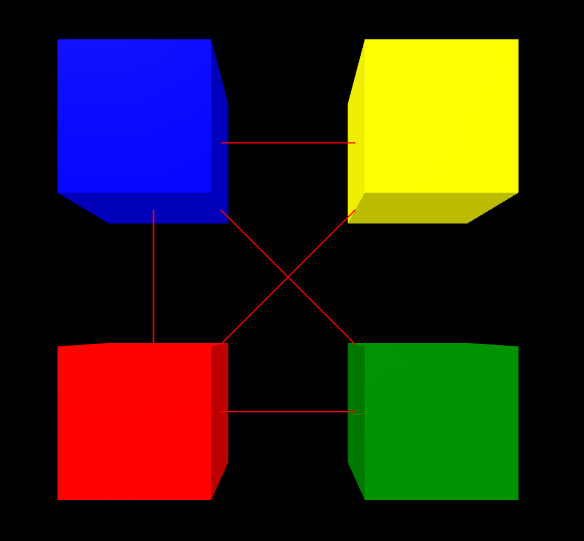
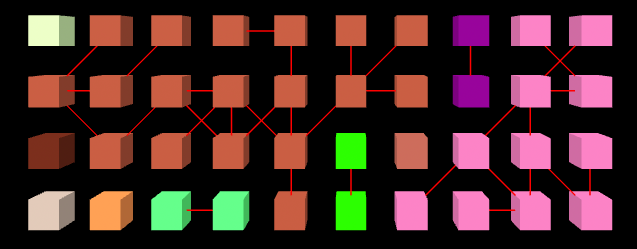

## Overview

A set of A-Frame components that can be used to build a graph of nodes & edges

Current focus is on tracking changes to the components (sets of connected nodes) that make up the graph.  May be extended to other applications of graphs in future.

### graph

Top-level component set on the `a-scene` to set properties of the graph.  Currently just controls debug display


### graph-node

Set this component on an entity that you want to appear as a node in the graph


### graph-edge

Set this component on an entity that is a node in the graph, to connect it via an edge to another node.  A node can have multiple edges, and can even have multiple edges to the same remote node.


## Schemas

### graph

| Property | Description                                 | Default |
| -------- | ------------------------------------------- | ------- |
| debug    | Draw lines to represent edges between nodes | false   |


### graph-node

This component has no properties


### graph-edge

| Property | Description                                                  | Default |
| -------- | ------------------------------------------------------------ | ------- |
| target   | A selector for the entity to connect the edge to.  Both entities must have the `graph-node`component set on them.  Edges are undirected. | none    |


## Events

The following events are emitted by the `edge` component when it is added or removed, and that results in a change to the connected components in the graph.

| Event                     | Description                                                  |
| ------------------------- | ------------------------------------------------------------ |
| `graph-components-joined` | Two components in the graph have been joined together into a single component. |
| `graph-components-split`  | A component in the graph has been split into two components. |


Each event includes additional detail as follows:

| Property         | Description                                                  |
| ---------------- | ------------------------------------------------------------ |
| `otherNode`      | The entity at the far end of the edge that was added / removed to trigger the event |
| `thisComponent`  | An array of Object3D UUIDs for the nodes in the component that this node is a member of. |
| `otherComponent` | An array of Object3D UUIDs for the nodes in the component that the node at the other end of the added / removed edge is a member of. |

For the joined event, the data in `thisComponent` & `otherComponent` represents the state before the join.  For the split event, it represents the state after the split event.

The state after the join event, or before the split event can be generated from this data by concatenating the two arrays.

Mapping Object3D UUIDs back to node entities is the responsibility of the application handling the events.  One option is to maintain a scene-level object with Object3D UUIDs as keys that map back to the node entities, as done in [this example](https://diarmidmackenzie.github.io/aframe-components/component-usage/graph.html).


## Installation

Via CDN 

```
<script src="https://cdn.jsdelivr.net/npm/aframe-graph@0.0.1/index.min.js"></script>
```

Or via [npm](https://www.npmjs.com/package/aframe-label)

```
npm install aframe-graph
```


## Examples

A simple example that builds a graph between 4 nodes:



```
    <a-scene background="color:black" graph="debug: true">

      <a-entity id="container" position = "0 0 -4">
        <a-box id="box1" position="-1 1 0"color="red"
               graph-node
               graph-edge__2="target:#box2"
               graph-edge__3="target:#box3">
        </a-box>
        <a-box id="box2" position="1 1 0"color="green"
               graph-node
               graph-edge__1="target:#box1"
               graph-edge__3="target:#box3">
        </a-box>
        <a-box id="box3" position="-1 3 0"color="blue"
               graph-node
               graph-edge__1="target:#box1"
               graph-edge__4="target:#box4">
        </a-box>
        <a-box id="box4" position="1 3 0"color="yellow"
               graph-node
               graph-edge__1="target:#box1">
        </a-box>
      </a-entity>
    </a-scene>
```

View the example [here](https://diarmidmackenzie.github.io/aframe-components/components/graph/test/).

A more complicated example, showing dynamic addition /removal of edges, and component detection can be seen [here](https://diarmidmackenzie.github.io/aframe-components/component-usage/graph.html).




## Code

[graph](https://github.com/diarmidmackenzie/aframe-components/blob/main/components/graph/index.js)

