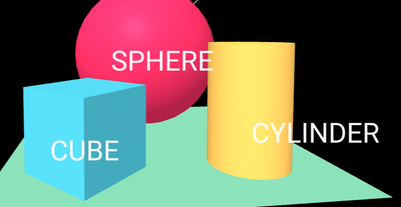
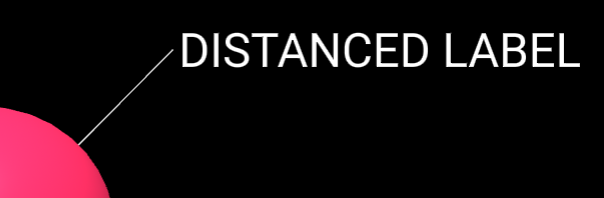

# label components

## Overview

A set of components that can be used to add labels to entities in desktop & VR experiences.

### label

Set this component on an entity to make it act like a label.  



This means that it will:

- always face in the direction of the camera, so that the user sees it straight on
- (on desktop, but not in VR) stay a fixed size on screen regardless of how near / far it is from the user (this behaviour is typically not desirable in VR - it feels very odd when peering closely at something makes it shrink!)
- (optionally) overwrite other entities in the scene, even those that occlude it.
- (optionally) have a line drawn to it from an entity that has a `label-anchor` component set on it.

The label component is commonly applied to `<a-text>` and `<a-image>` entities, but can be applied to any entity, with the same effects.

Note:  `label` assumes that the `scale` attribute of the entity it is set on is set to the default value of `1 1 1`

### label-anchor

This component is used alongside `label` to create a label that sits at a distance from an entity, with a line connected to it.




Set the `label-anchor` component on an entity positioned at the point that you want labelled.  The `offsetVector` attribute controls the offset to the label itself.  This offset will be scaled as the camera moves so that the line remains a fixed length from the user's perspective.

Add a child entity with the `label` component on it, describing the label that you want displayed at this offset position.

```
<a-entity position = "0.883 0.883 0" label-anchor="offsetVector: 0.2 0.2 0">
    <a-text material="color:white" value="DISTANCED LABEL" anchor="left" align="left"
            width=2
            label="overwrite:true"></a-text>
</a-entity>
```


### face-camera

This component is used by `label`, but can also be used directly.

When applied to an entity, it makes it behave like a [THREE.js Sprite](https://threejs.org/docs/#api/en/objects/Sprite), but it can be used with any entity (whereas THREE.js Sprite assumes a PNG image).

Unlike `label`, `face-camera` does not behave any differently between VR and desktop.  Most applications will want to handle VR and desktop differently, in which case it's probably better to use `label` than `face-camera`

Note:  `face-camera` assumes that the `scale` attribute of the entity it is set on is set to the default value of `1 1 1`


## Schemas

### label

| Property         | Description                                                  | Default |
| ---------------- | ------------------------------------------------------------ | ------- |
| overwrite        | Controls whether or not the label overwrites objects that are in front of it in space.  Set to "true" to make the label visible even if it is obscured by an object in front of it. | false   |
| forceDesktopMode | By default in VR entities are not scaled up/down based on distance from the camera, and they face the camera directly.<br /><br />On desktop, entities are scaled up/down based on distance from the camera, and they are oriented so that they appear flat on the screen (which is *not* directly at the camera for entities that are off-center).<br /><br />This setting forces labels to operate in the desktop manner, even when in VR. | false   |


### label-anchor

| Property     | Description                                                  | Default |
| ------------ | ------------------------------------------------------------ | ------- |
| offsetVector | Vector from the anchor to the label.  When non-zero, a line is drawn from the label to the anchor.  Note that this vector is scaled to keep the label a fixed distance from the  anchor, from the user's perspective. | none    |
| showLine     | Whether to show a line between the label and the anchor      | true    |
| lineColor    | What color line to draw between the label and the anchor     | white   |


### face-camera

| Property   | Description                                                  | Default |
| ---------- | ------------------------------------------------------------ | ------- |
| fixedSize  | Whether or not to scale the entity up & down based on distance from the camera, so that it always appears the same size the the user.  This effect can be disconcerting when used in VR. | false   |
| spriteMode | In "sprite mode" an entity will not face the camera directly, but will face in the opposite direction from the direction in which the camera is facing.  This results in the entity being rendered flat on the screen.<br /><br />When an orthographic camera is used "sprite mode" is always used, regardless of this setting. | false   |
| overwrite  | Controls whether or not the label overwrites objects that are in front of it in space.  Set to "true" to make the label visible even if it is obscured by an object in front of it. | false   |


## Installation

(this imports code for all components: `label`, `face-camera` and `label-anchor`)

Via CDN 

```
<script src="https://cdn.jsdelivr.net/npm/aframe-label@0.1.0/index.min.js"></script>
```

Or via [npm](https://www.npmjs.com/package/aframe-label)

```
npm install aframe-label
```

## Examples

[labels.html](https://diarmidmackenzie.github.io/aframe-components/component-usage/labels.html)


## Code

  [label](https://github.com/diarmidmackenzie/aframe-components/blob/main/components/label/index.js)