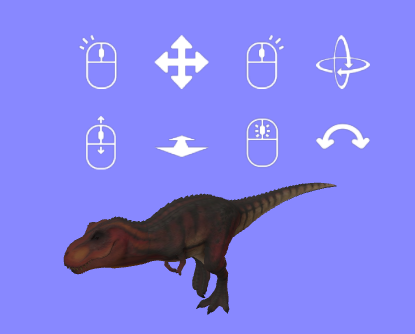

## Overview

The `mouse-manipulation` component can be used to provide a rich set of controls to manipulate entities in 3D space using the mouse.  The controls become active when an entity is hovered over with the mouse.




Controls are as follows:

| **Control**                     | Effect                                                       |
| ------------------------------- | ------------------------------------------------------------ |
| Hold left mouse button + drag   | Move entity around at a fixed distance from the camera.  When used in combination with look-controls, the camera will pan as well, but the control system handles this. |
| Hold right mouse button + drag  | Rotate the entity (pitch & yaw)                              |
| Hold middle mouse button + drag | Rotate the entity (roll)                                     |
| Mouse wheel                     | Move the entity towards / away from the camera (dolly)       |


## Schema

| Property  | Description                                                  | Default |
| --------- | ------------------------------------------------------------ | ------- |
| debug     | Turn on for debugging.  This displays small red and blue cubes to indicate the contact points being used to manipulate the entity, and some additional console logs. | false   |
| showHints | Controls whether hints are shown to the user indicating the control options | true    |


## Installation

This is a high-level component with a lot of dependencies.  In future I'll set up npm to build a single JS file with all these rolled in.  

For now, install as follows:

```
<script src="https://cdn.jsdelivr.net/gh/diarmidmackenzie/aframe-components@latest/components/object-parent.min.js"></script>
<script src="https://cdn.jsdelivr.net/gh/diarmidmackenzie/aframe-components@latest/components/cursor-tracker.min.js"></script>
<script src="https://cdn.jsdelivr.net/gh/diarmidmackenzie/aframe-components@latest/components/label.min.js"></script>
<script src="https://cdn.jsdelivr.net/gh/diarmidmackenzie/aframe-components@latest/components/mouse-manipulation.min.js"></script>
```


## Examples

[mouse-manipulation.html](https://diarmidmackenzie.github.io/aframe-components/component-usage/mouse-manipulation.html)

[object-manipulation.html](https://diarmidmackenzie.github.io/aframe-components/component-usage/object-manipulation.html) - This uses mouse manipulation in desktop mode.  When you enter VR on a non-VR desktop, the controllers themselves become targets of mouse manipulation, via the [desktop-vr-controller](https://diarmidmackenzie.github.io/aframe-components/docs/desktop-vr-controller.html) component.


## Proxy Raycasting

`mouse-manipulation` supports proxy raycasting via the [raycast-target](https://diarmidmackenzie.github.io/aframe-components/docs/raycast-target.html) component


## Other Components

The mouse-manipulation component makes use of a number of other sub-components.

If you just want to use mouse-manipulation as-is, there's no need to worry about these.  However these sub-components may be useful in other contexts as well, so they are documented here.

### mouse-manipulation-hints

This component is used to display the on-screen hints available when using mouse-manipulation

| Property | Description                                                  | Default |
| -------- | ------------------------------------------------------------ | ------- |
| view     | Which set of hints to show.  One of the following:<br />- none: show no hints<br />- hover: show all controls available when hovering over an entity<br />- left: show controls available when left mouse button is down<br />- middle: show controls available when middle mouse button is down<br />- right: show controls available when right mouse button is down | none    |

### mouse-pitch-yaw

This component is used to control the pitch and yaw of an entity based on the mouse pointer position.

| Property   | Description                                                  | Default |
| ---------- | ------------------------------------------------------------ | ------- |
| singleAxis | Whether to only allow rotation on a single axis (whichever moves first) | false   |
| threshold  | When operating in "singleAxis" mode, number of mouse pixels movement required to lock onto an axis. | 5       |

Example: [mouse-object-control.html](https://diarmidmackenzie.github.io/aframe-components/component-usage/mouse-object-control.html)


### mouse-roll

This component is used to control the roll of an entity based on the mouse pointer position.  The entity can be rolled by moving the mouse around the entity, clockwise or anti-clockwise.


| Property       | Description                                                  | Default |
| -------------- | ------------------------------------------------------------ | ------- |
| slowdownRadius | When the mouse is very close to the center of the entity, very small movements can result in very large rotations, which results in a poor user experience.<br /><br />This property specifies a radius (measured in pixels) within which rotation will be proportionately slowed down, to avoid this effect. | 50      |

This component has a dependency on the entity-screen-position component, (see below)

Example: [mouse-object-control.html](https://diarmidmackenzie.github.io/aframe-components/component-usage/mouse-object-control.html)


### entity-screen-position

This component is used to obtain the on-screen position of an entity.  It is used by the `mouse-roll` component to determine how the x/y mouse co-ordinates relate to the position of the entity itself, which is needed to determine how to transform the entity.

This component has no schema.  It exposes the following interface

| Method                    | Parameters                                                   | Returns                                                      |
| ------------------------- | ------------------------------------------------------------ | ------------------------------------------------------------ |
| getEntityScreenPosition() | A THREE.Vector2 that can be used to store the x, y co-ordinates of the entity on screen | The supplied THREE.Vector2, with x & y values indicating the on-screen position of the entity. |


### mouse-dolly

This component is used to dolly an entity forwards or backwards based on the movement of the mouse wheel.

It has no configurable properties (speed of dollying is not currently configurable)

Example: [mouse-object-control.html](https://diarmidmackenzie.github.io/aframe-components/component-usage/mouse-object-control.html)


## Code

  [mouse-manipulation.js](https://github.com/diarmidmackenzie/aframe-components/blob/main/components/mouse-manipulation.js)