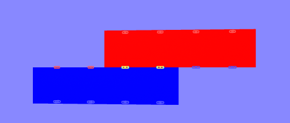
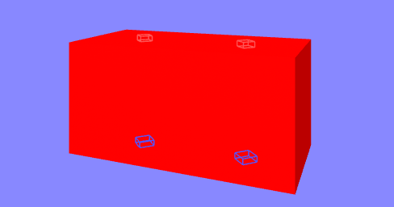

# plug-socket system


-----------------

**WARNING TO POTENTIAL USERS: This is a fairly complex set of A-Frame components, at an early stage of development**

**Interfaces and implementation details are likely to change going forwards, potentially in non-back-compatible ways.  And there will be bugs...**

--------------------


## Overview

[snapPositionInterface]: https://diarmidmackenzie.github.io/aframe-components/components/dynamic-snap#snapPositionInterface
[dynamicSnap]: https://diarmidmackenzie.github.io/aframe-components/components/dynamic-snap

A set of components to support connecting together A-Frame entities based on a configurable set of plugs and sockets.




The system is configurable, but the general principles are that:

- plugs attach to sockets
- plugs and sockets do not move by themselves, but move their parent **socket fabric** into a position so that the plugs and sockets align
- as an alternative to automatic movement, the **socket fabric** can emit snap events, indicating a desired position to move to, which can then be handled by a movement system (e.g. via the [`dynamic-snap`][dynamicSnap] component)
- plugs can connect into sockets at a (configurable) number of different rotations.
- where a socket fabric has multiple plugs & sockets, these can result in conflicting movements.  The `socket-fabric` component resolves these conflicts (e.g. by prioritizing the majority and rejecting the others)


Example applications of this system include

- snapping together building blocks with fixed attachment points
- kitchen design tools, where kitchen units automatically clip together
- chemistry molecular modelling set consisting of atoms and bonds
- 3D jigsaw puzzles


## Usage

The system consists of several elements.

An entity that has plugs or sockets configured on it must have the `socket-fabric` component configured on it, for example like this:

```
          <a-box position = "-1 1.1 0"
                width = 2
                socket-fabric
                color="red">
          </a-box>
```

Plugs and sockets are then be configured as child entities beneath the `socket-fabric` entity, like this:

```
      <a-box position = "-1 1.1 0"
            width = 2
            socket-fabric
            color="red">
        <a-entity socket position = "-0.5 -0.5 0">
        </a-entity>
        <a-entity socket position = "0.5 -0.5 0">
        </a-entity>
        <a-entity plug position = "-0.5 0.5 0">
        </a-entity>
        <a-entity plug position = "0.5 0.5 0">
        </a-entity>
      </a-box>
```

The above example configures a 2 x 1 x 1 block, with two evenly-spaced plugs on its top, and two evenly-spaced sockets on its base, as shown in this image (sockets are invisible by default, but can be shown in [debug mode](#socket-system).




Overall configuration for the overall plug/socket system can be specified on the A-Frame scene like this: 

```
<a-scene socket="snapDistance: 0.2; debug: true">
```

(see [below](#socket-system) for schema, which details all the options)


## System Overview

Each entity in a scene that is able to connect to other entities in the scene must have a `socket-fabric` component configured on it.

Each such entity can then have any number of plug and socket entities configured as children, each with its own position and rotation relative to the parent entity.

The socket system keeps track of all the plugs and sockets in the scene, including which of them are bound to another plug / socket, and which of them are free.

For each free plug, the socket system continuously monitors whether it comes into range & alignment with a free socket.  Plugs seek to connect to sockets that are close by, and in reasonably close alignment (plugs always ignore sockets on the same fabric as them).  To join together, plugs and sockets must align their y-axes, but there is potential for rotation about this y-axis (currently this can only be discrete number of fixed positions - see [`rotationIncrement` property below](#socket-system) for more details).

When a free plug and socket are in close range & close alignment, requests are made to the socket fabric to re-align with this position, so that the plug & socket can align exactly.  This re-alignment can either be:

- automatic, so that entities immediately snap into place when plugs come close to sockets
- event-driven, so that snapping into position can be controlled by another component (e.g. `dynamic-snap`)

Sockets and plugs have **"inertia"** which controls which one of them moves, in order to snap together (currently the inertia logic is very simple, but it may be extended in future).

A socket fabric with multiple plugs & sockets may receive multiple simultaneous requests to re-align, which may be in conflict with each other.  The socket fabric resolves these conflicts (currently using a simple majority - more flexibility may come in future), and determines which of the requests are honored, and which are rejected.

The system does not yet implement any logic to maintain relative positions of entities that are bound together by plug/socket connections.  When modifying the transform of an entity that is bound via plugs or sockets to another entity, applications must take care of updating the other entities (or explicitly break the binds of the entity before moving it).


## Schemas

### socket system

| Property          | Type    | Description                                                  | Default |
| ----------------- | ------- | ------------------------------------------------------------ | ------- |
| snapDistance      | number  | The maximum distance, in world space units, that a plug and socket will snap together | 0.1     |
| snapRotation      | number  | The maximum angle, in degrees, that a plug and socket may be offset by, relative to a snappable orientation, in order for that plug and socket to snap together. | 50      |
| rotationIncrement | number  | Plugs and sockets must align exactly on their x and z rotations, but there is flexibility in the rotation of the y axis.  This parameter specifies the angle (in degrees) between positions at which a plug and socket can be fixed together.  90 degrees results in 4 possible positions of the plug & socket (like a square plug into a square socket).  60 degrees would result in 6 possible positions (like a hexagonal plug in a hexagonal socket).<br />In theory, 0 degrees would result in completely flexible rotation of the plug in the socket (a cylindrical plug in a cylindrical socket).  However the current implementation searches linearly through possible positions, and so will not perform well for low values of `rotationIncrement` - as a guideline, values below 30 degrees are not recommended. | 90      |
| debug             | boolean | Enables debug visualization of the positions of plugs & sockets.  Also enables some console logging. | false   |


### socket-fabric

| Property | Type   | Description                                                  | Default |
| -------- | ------ | ------------------------------------------------------------ | ------- |
| snap     | string | One of: `auto` or `events`.<br />In "auto" mode, the socket fabric moves immediately when plugs or sockets request to bind to peer sockets or plugs.<br />In "events" mode, the socket fabric does not move itself, but emits `snapStart` and `snapEnd` events, allowing movements to be controlled by an externa component such as `dynamic-snap`. | `auto`  |

### socket

| Property | Type   | Description                                                  | Default  |
| -------- | ------ | ------------------------------------------------------------ | -------- |
| type     | string | One of: `plug` or `socket`.<br /><br />The `socket` component implements both plug & socket functionality.  This property should not be set explicitly.  Rather, sockets should be created using the `socket` component (with no properties), and plugs should be created using the `plug` component (again, with no properties) | `socket` |

### plug

The plug component currently has no properties on its schema.

Note that the `plug` component is in fact just a thin wrapper that configures a `socket` component of `type: plug`


## Interfaces


### Socket Data

The `socket` component exposes the following binding data, which is used when handling binding requests:

| Property                    | Description                                                  |
| --------------------------- | ------------------------------------------------------------ |
| `isSocket`                  | `true` for a socket, `false` for a plug.                     |
| `bindingState`              | binding state of the plug or socket.  Takes one of the following values:<br />- `PS_STATE_FREE` - available for binding<br />- `PS_STATE_BINDING` - requested binding to a peer socket or plug<br />- `PS_STATE_BOUND` - bound to a peer socket or plug<br />- `PS_STATE_TARGET` - a peer socket or plug has requested binding (or is bound to) this socket or plug<br />- `PS_STATE_FAILED` - a binding request failed.  This is a transient state used while cleaning up a failed binding attempt.  Following clean-up, state returns to `PS_STATE_FREE`<br /> |
| `worldSpaceObject`          | An Object3D representing the transform of this plug or socket in world space.  This is maintained every frame via the socket component's `tick()`method. |
| `peer`                      | The plug or socket that is being bound to.  This refers to the world-space Object3D for the peer plug or socket.  From this, the plug/socket entity can be accessed as `peer.el`, and its `socket` component as `peer.el.components.socket` |
| `adjustmentTransform`       | An Object3D representing a proposed transform for this plug or socket, in order to bind to a peer socket or plug.  This is a transform to be applied in world space.  This is set prior to sending a `binding-request` event to the fabric. |
| `fabricAdjustmentTransform` | An Object3D made available by the socket component to it's parent fabric, which uses it in computations.  This is allocated by, and made available by, the `socket` component, as a convenience for the `socket-fabric`component. |


### Binding Events

Binding events flow internally between plug/sockets entities and their parent socket fabric as follows.  Binding is asymmetric, and happens in one direction, either plug to socket or socket to plug, depending on the "inertia" of their parent fabrics.

The binding plug or socket moves (or attempts to move), while the socket or plug that is bound-to remains stationary.

| Event           | Emitted by  | Consumed by | Description                                                  |
| --------------- | ----------- | ----------- | ------------------------------------------------------------ |
| binding-request | plug/socket | fabric      | Indicates that the plug (or socket) would like to bind to a corresponding socket (or plug).  The event is emitted on the plug or socket that is binding (i.e. the one that will move).<br />The event does not contain any additional detail.  However prior to emitting the event, the plug or socket sets it's `adjustmentTransform` property to indicate the adjustment required to achieve the proposed binding. |
| binding-cancel  | plug/socket | fabric      | Indicates that any binding involving this plug or socket should be cleared.  This can be emitted at any time, by either peer involved in a binding.  Whereas `binding-request` may succeed or fail, a `binding-cancel` always takes effect immediately.<br />!! MIGHT BE BETTER TO NAME THIS `binding-clear`??? |
| binding-success | fabric      | plug/socket | This is emitted by the `socket-fabric` component, on the plug / socket entity as the `binding-request`.  It indicates that requested binding has taken place successfully.  This event should only be emitted once the socket or plug that requested the binding has been moved into the requested position. |
| binding-failed  | fabric      | plug/socket | This is emitted by the `socket-fabric` component, on the plug / socket entity as the `binding-request`.  It indicates that requested binding has not occurred, and will not occur.  Typically this is because conflicting binding requests made to the socket fabric have been prioritized over this request. |

### Inertia

When the socket system matches a socket to a plug, **inertia** is used to determine which of them should move (in the case of a tie, the plug moves to meet the socket).

The `socket` component offers a function, `getInertia()`, which computes and returns the inertia of this socket.


### Breaking bonds

It can be useful to break all bonds for a given `socket-fabric`

The `socket-fabric` component provides a `breakBonds()` function that does this.

(!! currently, this function is triggered automatically when a `mouseGrab` event is received on the `socket-fabric` entity - but this needs cleaning up!!)

Note that calling `breakBonds()`, without moving the entity, will immediately result in a new set of binding requests, as the plugs and sockets that are aligned will detect each other, and trigger binding again.  Viable approaches for breaking the bindings of a socket fabric include:

- move the socket fabric to a new position, and then call `breakBonds()`
- use "events" snap mode.  In this case, the new binding requests will result in `snapStart` events, but unless that event is responded to with a `snappedTo` event, the new binding requests won't succeed.


### Snap Position Interface

When operating in "events" mode, `plug-socket` implements the [Snap Position Interface][snapPositionInterface], which allows it to be used with the [`dynamic-snap`][dynamicSnap] component

It emits `snapStart` and `snapEnd` events, based on , and listens for the `snappedTo` event generated by `dynamic-snap` when an entity snaps to a position.


## Installation

Via CDN 

```
<script src="https://cdn.jsdelivr.net/npm/aframe-plug-socket@0.0.1/dist/plug-socket.min.js"></script>
```

Or via [npm](https://www.npmjs.com/package/aframe-dynamic-snap)

```
npm install aframe-plug-socket
```

then in your code...

```
if (!AFRAME.components['socket']) require('aframe-plug-socket')
```

(the `if` test avoids conflicts with other npm packages that may also use `aframe-plug-socket`)

## Examples

Examples to follow...

See also: [tests](https://diarmidmackenzie.github.io/aframe-components/components/plug-socket/test/)


## Code

[plug-socket](https://github.com/diarmidmackenzie/aframe-components/blob/main/components/plug-socket/index.js)


## Unit Tests

A basic set of QUnit Unit Tests exist, which can be found here: https://diarmidmackenzie.github.io/aframe-components/components/plug-socket/test/unit-tests.html

Currently these can only be run in the browser, not at the command line.


## Future Features

A brief list of some ways in which the plug/socket system might be developed in future:

- General review & clean-up of interfaces
- Support for smooth rotation of sockets within plugs
- Support for non-rigid socket fabric (e.g. flexible tube joiners with plugs at both ends)
- Configurable keys on plus & sockets so that only those with matching keys can join together.
- Maybe the whole plug/socket distinction goes away, and we have flexibility to specify multiple socket types, and a flexible masking system indicating what can join to what.
- Improved / more flexible inertia system
- Solving the question of how to move entities that are bound together by plugs/sockets as a single entity.
- More examples, including examples showing integration with physics engines
- UT improvements - more tests, run at command line
- Performance optimizations
  - Use of instanced-mesh for debug visualization
  - Better matching algorithms
  - Perf tuning golden path

