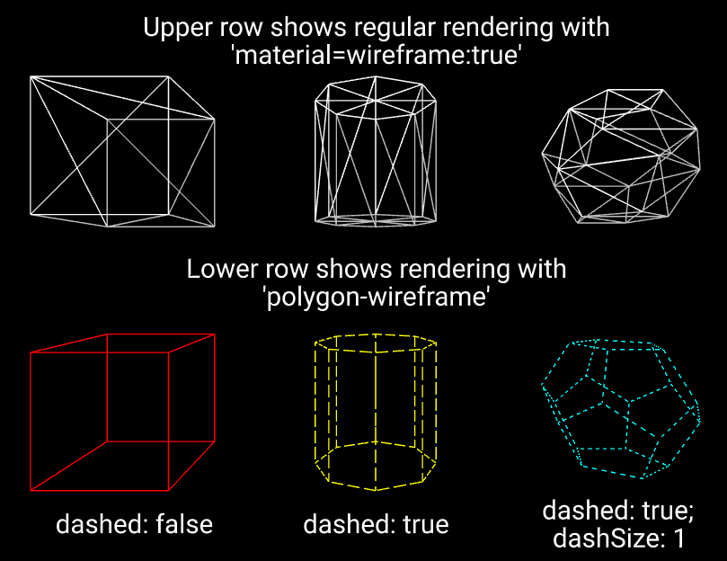

## Overview

A component to display wireframes composed of polygons, rather than triangles.




## Schema

| Property  | Description                                                  | Default |
| --------- | ------------------------------------------------------------ | ------- |
| color     | The color to use for the lines of the wireframe              | grey    |
| dashed    | Whether to use dashed lines.  If false, solid lines are used | false   |
| dashSize  | If dashed lines are used, the length of the dashes relative to the gaps | 3       |
| gapSize   | If dashed lines are used, the length of the gaps relative to the dashes | 1       |
| dashScale | If dashed lines are used, this determines the scale of the dashes / gaps.  Whatever units are used for dashSize & gapSize, this is the number of units that will fit into a 1 unit of length (i.e. 1 meter if the entity has default scaling).<br /><br />Larger values for dashScale result in smaller dashes / gaps. <br /><br />With the default values for dashScale, dashSize and gapSize, and default entity scaling, dashes will be 10cm (3 x 100 / 30), and gaps 3.33cm (1 x 100 / 30). | 30      |

## Installation

```
<script src="https://cdn.jsdelivr.net/gh/diarmidmackenzie/aframe-components@latest/components/polygon-wireframe.min.js"></script>
```


## Examples

[polygon-wireframe.html](https://diarmidmackenzie.github.io/aframe-components/component-usage/polygon-wireframe.html)


## Code

  [polygon-wireframe](https://github.com/diarmidmackenzie/aframe-components/blob/main/components/polygon-wireframe/index.js)