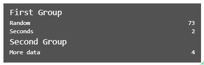

## Overview

Custom statistics based on custom events, output in the same style as A-Frame stats.

### stats-panel

An optional component.  This is required to add custom stats if the A-Frame `stats` component might not be present on the scene.

If the A-Frame `stats` component *is* present on the scene, this can be used with `merge: false` to separate the custom stats into a separate panel in the bottom left corner.

| Property | Description                                                  | Default |
| -------- | ------------------------------------------------------------ | ------- |
| merge    | If an A-Frame stats panel is present, should the additional stats be merged into it?  If "true", they are appended at the end.  If "false", the additional stats are shown in a new panel in the bottom left corner of the screen. | false   |

### stats-group

Used to group stats rows.  Every `stats-row` must be in a `stats-group`, referencing it by name if there is more than one.

The name of the `stats-group` is specified in the component name: the part that appears after the `__` in the component name is the group name.

| Property | Description                                                  | Default |
| -------- | ------------------------------------------------------------ | ------- |
| label    | The label for this stats group - displayed in the stats panel. | blank   |

### stats-row

A row of data to be displayed in a stats table.

The source of data for a row is always an event, with some properties in its `detail`

| Property   | Description                                                  | Default |
| ---------- | ------------------------------------------------------------ | ------- |
| group      | Every statistics row must be displayed in a group.<br />This component uses this name to search for a group to add the row to.  It searches for:<br />- a group with a matching name on the same entity<br />- a group with a matching name on the scene<br />- any unnamed group on the entity<br />- any unnamed group on the scene., |         |
| event      | The name of the event that provides data for this stats row.  Each time the event is detected, the stats row will be updated with data from the event.  Note that the `stats-row` must be configured on an entity that will detect the event. |         |
| properties | The names of one or more properties within the `detail` of the event that is to be displayed in the `stats-row`.  These are displayed without any additional formatting.  If additional formatting / processing is required, write an additional component that listens for the event and modifies the data as required.  If multiple properties are specified, they are displayed left-right.  Typically 3-4 data items can be fitted into a row, if required. |         |
| label      | The label for this stats row - displayed in the stats panel. |         |


### stats-collector

Processes a data stream, and reports periodic summary data (min, max, mean & percentiles)

The source of data for is always an event, with some properties in its `detail`

| Property        | Description                                                  | Default |
| --------------- | ------------------------------------------------------------ | ------- |
| inEvent         | The name of the event that provides data for this stats collector.  Each time the event is detected, a new data entry is added to the data set being analysed by this stats collector  Note that the `stats-collector` must be configured on an entity that will detect the event. |         |
| properties      | The names of one or more properties within the `detail` of the event that is to be collected by this stats-collector.  The `stats-collector` will analyze and output data in the same way, for each property specified.<br />Unlike `stats-row`, nested properties are not yet supported. |         |
| outputFrequency | How often summary statistics are output by this statsCollector, expressed as a count of input events.<br />Note that in the current implementation, when summary stats are output, *all previous data is discarded* , so this also defines the size of data set analyzed when computing min, max and percentiles.  A high value here will result in more accurate summary stats, but they will update less frequently.<br />Multiple parallel `stats-collectors` can be used to generate summary stats over multiple different data population sizes, giving the best of both worlds. | 100     |
| outEvent        | The name of the event that is used to output summary stats.  Summary stats data is included in the `detail` of this event. |         |
| outputs         | A list of outputs to generate for each property analyzed by the stats collector.  Some combination of the following strings:<br />- `mean` for the mean of the data<br />- `max` for the max value from the data<br />-`min` for the min value from the data<br />-`percentile__XX_X` for a percentile value from the data, e.g. `percentile__25` for the 25th percentile, or `percentile_99_9` for the 99.9th percentile.  Note that percentiles will only be as accurate as they can be with the volume of data gathered.  There's no attempt to model distributions and estimate percentiles outside the range of available data. |         |
| outputToConsole | Whether to output to console as well as generating events.  If a string is specified, this is output to console, together with the event data.  If no string is specified, nothing is output to console. |         |


## Installation

```
<script src="https://cdn.jsdelivr.net/gh/diarmidmackenzie/aframe-components@latest/components/stats-panel/index.min.js"></script>
```


Or from npm:

https://www.npmjs.com/package/aframe-stats-panel


## Examples

Here's an example of `stats-panel` components set on an `a-scene` to display 3 additional stats rows, in 2 groups.

```
    <a-scene stats
        stats-panel="merge: false"
        stats-group__1="label: First Group"
        stats-group__2="label: Second Group"
        stats-row__1="group: 1; event: event1; property: secs; label: Seconds"
        stats-row__2="group: 1; event: event1; property: random; label: Random"
        stats-row__3="group: 2; event: event2; property: data; label: More data"
        generate-data>
```

With suitable events generating input, this will generate output like this:



See a live example here: [stats-panel.html](https://diarmidmackenzie.github.io/aframe-components/component-usage/stats-panel.html)	

See a live example of how `stats-collector` can be used to aggregate summary statistics here: [stats-collector.html](https://diarmidmackenzie.github.io/aframe-components/component-usage/stats-collector.html)

## Code

  [stats-panel](https://github.com/diarmidmackenzie/aframe-components/blob/main/components/stats-panel/index.js)