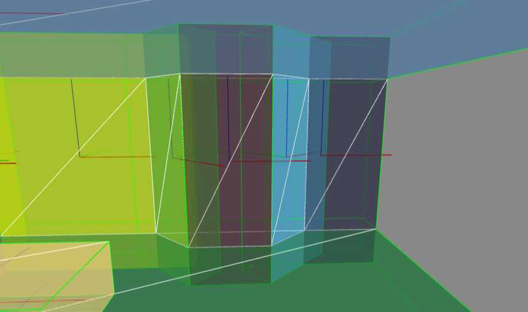
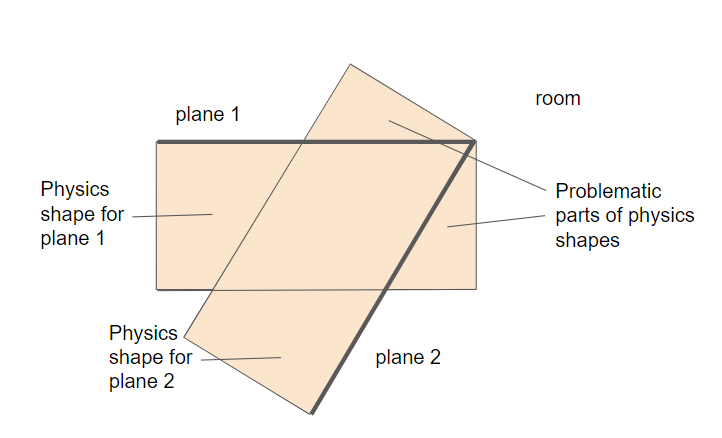
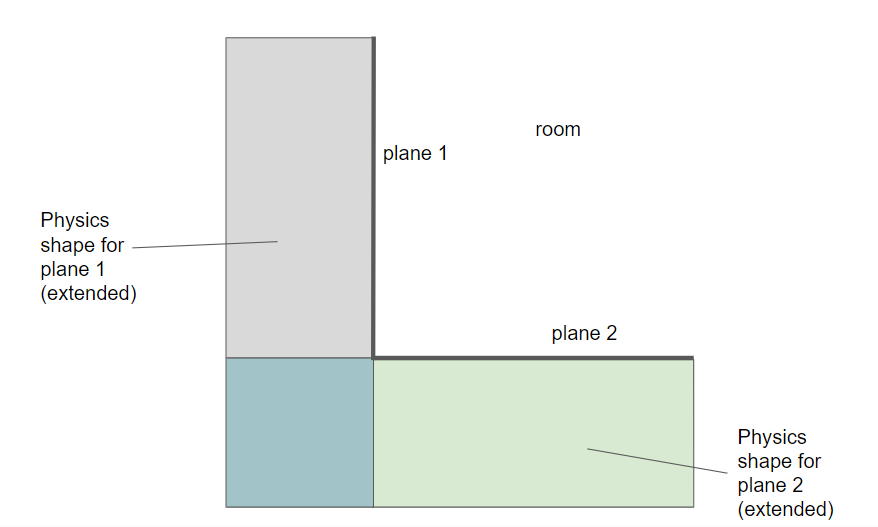
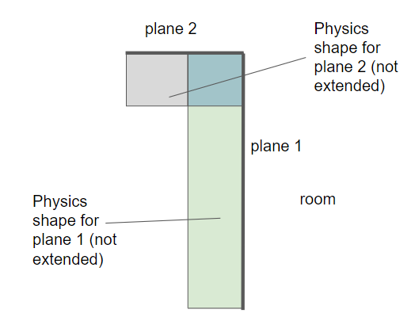

# xr-room-physics

## Overview

A component that supports simple set-up of physics to match the set of XRPlanes reported by WebXR (e.g. as configured in "room setup" on Oculus Quest).

https://github.com/diarmidmackenzie/aframe-components/assets/16045703/9d97d49a-6fcd-450e-a120-e7278b0bcec6


Compatible with:

- [aframe-physics-system](https://github.com/c-frame/aframe-physics-system) (Cannon & Ammo drivers)
- [physx for A-Frame](https://github.com/c-frame/physx) 

On Oculus Quest, room setup is still an "experimental" feature.  [Here's a guide for setting it up](https://www.androidcentral.com/gaming/virtual-reality/how-to-set-up-your-room-for-meta-quest-pro-mixed-reality).


## Demo

If you have an Oculus Quest headset with room setup configured, you can try this using one of the top 3 links [here](https://diarmidmackenzie.github.io/aframe-components/components/xr-room-physics/test/)

Trigger to shoot balls, press A on the controller to toggle debug visualization.

If you are looking at this on a desktop, use the next set of links down, [here](https://diarmidmackenzie.github.io/aframe-components/components/xr-room-physics/test/#:~:text=testing%20on%20desktop).  These use the `desktop-xr-plane` to simulate a basic room setup on desktop.


## Usage

Add the `xr-room-physics` component to your scene, along with your physics system setup.  You will also typically need the `plane-detection` and `local-floor` WebXR features.

If you want the planes to occlude objects behind them, you must also set `renderer="sortObjects: true"` on the `<a-scene>` (this may change in future - see [this A-Frame issue](https://github.com/aframevr/aframe/issues/5332))

Some examples...

Cannon Physics with full debug:

```
<a-scene webxr="requiredFeatures: plane-detection,local-floor"
         renderer="sortObjects: true"
         physics="debug: true"
         xr-room-physics="debug: true">
```


Ammo physics with no debug visualization

```
<a-scene webxr="requiredFeatures: plane-detection,local-floor"
         renderer="sortObjects: true"
         physics="driver: ammo"
         xr-room-physics>
```


PhysX with reduced plane depth (since CCD can be used with PhysX)

```
<a-scene webxr="requiredFeatures: plane-detection,local-floor"
         renderer="sortObjects: true"
         physx="autoLoad: true"
         xr-room-physics="depth: 0.05">
```



(image shows full debug mode, with visual representations of all physics objects)

## Schema


| Property       | Description                                                  | Default            |
| -------------- | ------------------------------------------------------------ | ------------------ |
| debug          | When enabled, planes are rendered semi-opaque in random colors, to aid in debugging.  Enabling debug also generates additional console logging related to physics shape calculations. | false              |
| showPlanes     | When debugging, which planes to show: "horizontal", "vertical", or "all" | all                |
| depth          | Depth (i.e. thickness) to use for walls and surfaces (in meters).  When  Continuous Collision Detection (CCD) is not supported, or is not enabled, a significant depth is needed to prevent fast-moving objects from travelling through planes.<br />As well as extruding walls by this depth, planes are also extended where they meet at corners with other plans, to avoid "leakage" at seams and corners (see [more on leak protection](#leak-protection))<br />Changing this setting will not affect planes that have already been created. | 0.5                |
| rayOrigin      | The origin used for raycasting for  [leak protection](#leak-protection).  This should be a point inside the room.<br />Changing this setting will not affect planes that have already been created. | x: 0, y: 1.5, z: 0 |
| delta          | The delta (in meters) used for checking whether to extend a plane for [leak protection](#leak-protection).  Smaller values will typically give more precise extensions, but one-time room setup will be more expensive to compute.<br />Changing this setting will not affect planes that have already been created. | 0.1                |
| receiveShadows | Shadows will be cast on the planes by objects that cast shadows.  Also requires [shadow config to be set up on the rest of the scene in the normal way](https://aframe.io/docs/1.4.0/components/shadow.html).  Changing this value will not affect planes that have already been created. | true               |
| shadowOpacity  | The opacity of shadows received on the planes.               | 0.5                |
| occludeObjects | Objects that are behind the planes will be occluded by the planes.  For this to work reliably, `renderer="sortObjects: true"`must be set on the `<a-scene>`.  Changing this value will not affect planes that have already been created. | true               |
| renderOrder    | renderOrder value used for occlusion.  -1 is usually sufficient, but if your scene sets negative renderOrder values on other Object3Ds, you might need to set a larger negative. | -1                 |


## Limitations

Because planes are extruded by a configurable depth, probems will occur if two planes meet at a convex angle of less than 90 degrees.



If using PhysX, these problems can be avoided by using a very small "depth" value for the walls, and using CCD.

For physics systems that don't support CCD, there is currently solution for this problem.  If you make the walls thin without CCD, fast-moving objects will tend to be able to pass through them.


## Leak Protection

When two planes meet at a corner, the physics objects for them are extended by an	 amount up to the configured depth value.  This eliminates the risk of "leakage" at these corners, when CCD is not supported or is not configured.



These extensions happen at corners where two walls meet, and also at the meeting points between walls and ceilings/floors.  In these cases, extending the physics shape won't interfere with the room space itself.

Planes that do not meet other planes (e.g. a desk) are not extended.  Planes that meet other planes at a convex corner are also not extended, so as not to interfere with the room space.




## Installation

Via CDN 
```
<script src="https://cdn.jsdelivr.net/npm/aframe-xr-room-physics@0.0.1/dist/xr-room-physics.min.js"></script>
```

Or via [npm](https://www.npmjs.com/package/aframe-polygon-wireframe)

```
npm install aframe-xr-room-physics
```


## Examples

There is an example for each supported physics system.  These have no pre-configured walls, so you'll only get results if you run these on a VR headset, and if you have run "room setup", or an equivalent process.  [Here's a guide for doing that on a Meta Quest](https://www.androidcentral.com/gaming/virtual-reality/how-to-set-up-your-room-for-meta-quest-pro-mixed-reality).

- [Cannon Physics](https://diarmidmackenzie.github.io/aframe-components/xr-room-physics/test/cannon-room.html)
- [Ammo Physics](https://diarmidmackenzie.github.io/aframe-components/xr-room-physics/test/ammo-room.html)
- [PhysX Physics](https://diarmidmackenzie.github.io/aframe-components/xr-room-physics/test/physx-room.html)


If you want to check this out on a desktop computer, there are also some examples that use the `desktop-xr-plane` component to simulate a set of XRPlanes (i.e. to simulate a configured "room layout").

You can find these [here](https://diarmidmackenzie.github.io/aframe-components/components/xr-room-physics/test/#:~:text=testing%20on%20desktop).


## Code

  [xr--room-physics](https://github.com/diarmidmackenzie/aframe-components/blob/main/components/xr=-room-physics/index.js)


## Acknowledgements

Thanks to the team at Meta for the [Reality Accelerator Toolkit (RATK) for THREE.js](https://github.com/meta-quest/reality-accelerator-toolkit), which this component builds upon.


