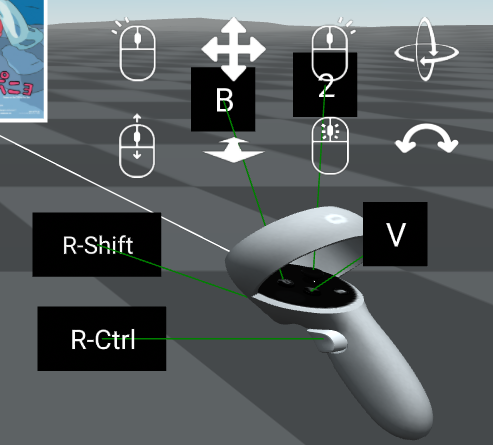
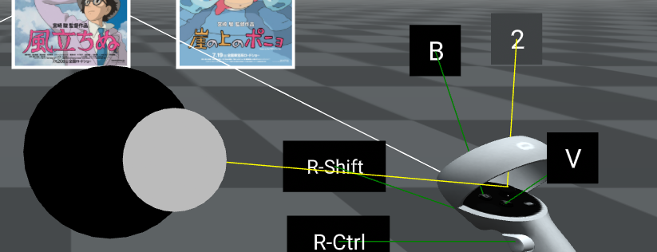
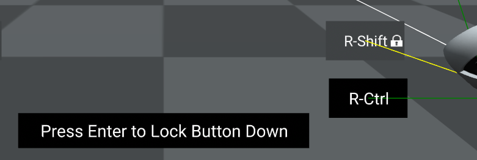
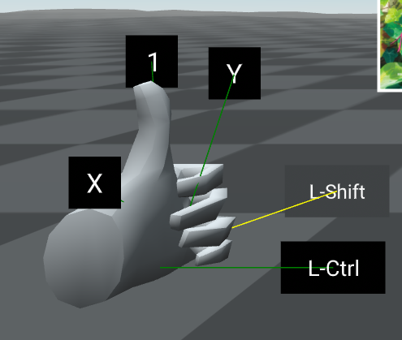

## desktop-vr-controller

When entering VR on a desktop system with no actual VR headset / controllers attached, simulates a VR controller on the desktop, controllable using mouse & keyboard.

The simulated controller is always an Oculus Quest 2 controller.

## Controls

The component only has an effect on desktop systems with no actual VR headset / controllers attached.  On a VR headset, or a desktop system with a VR headset / controllers attached, it should have no effect.

Contextual prompts appear next to the controller, showing the available controls.



The controller can be moved and rotated using the mouse:

- left button + drag to move left/right and up/down
- right button + drag to pitch and yaw
- roll mouse wheel while holding left or right button to move in / out
- middle mouse button + drag to roll

Buttons can be pressed using the keyboard:

- Left shift / left control for left grip and trigger
- Right shift / right control for right grip and trigger
- X & Y for X & Y buttons (on left controller)
- V & B for A & B buttons (on right controller) - not e that V is used instead of A to avoid overlap with WASD

Thumbsticks can be controlled as follows:

- Hold down 1 or 2 to engage thumbstick for the left or right controller
- A thumstick controller will appear on-screen at the current mouse location.  Move the mouse to move the thumbstick.
- Left or right click can be used to click the thumbstick.



The Enter key can be used to lock any controller button in the down position.  This is particularly useful to lock thumbstick activation, and can also be useful to simulate holding down grip or trigger.

Locked buttons can be released by pressing and releasing the corresponding key.



On mobile devices, including the desktop-vr-controller component will cause a simulated VR controller to appear, but it will not be usable.


## Schema

None.  Currently there are no configurable settings.

There's lots of settings that could be usefully configurable, and hopefully will be in a future version


## Installation

This is a high-level component with a lot of dependencies.  In future I'll set up npm to build a single JS file with all these rolled in.  

For now, install as follows:


<script src="https://cdn.jsdelivr.net/gh/diarmidmackenzie/aframe-examples@latest/components/cursor-tracker.min.js"></script>
<script src="https://cdn.jsdelivr.net/gh/diarmidmackenzie/aframe-examples@latest/components/mouse-manipulation.min.js"></script>
<script src="https://cdn.jsdelivr.net/gh/diarmidmackenzie/aframe-examples@latest/components/label.min.js"></script>
<script src="https://cdn.jsdelivr.net/gh/diarmidmackenzie/aframe-examples@latest/components/raycaster-thresholds.min.js"></script>
<script src="https://cdn.jsdelivr.net/gh/diarmidmackenzie/aframe-examples@latest/components/connecting=-line.min.js"></script>
<script src="https://cdn.jsdelivr.net/gh/diarmidmackenzie/aframe-examples@latest/components/raycast-target.min.js"></script>
<script src="https://cdn.jsdelivr.net/gh/diarmidmackenzie/screen-display@latest/src/screen-display.js"></script>            
<script src="https://cdn.jsdelivr.net/gh/diarmidmackenzie/aframe-examples@latest/components/desktop-vr-controller.min.js"></script>


## Usage

Add the `desktop-vr-controller` attribute to any entity that uses `oculus-touch-controls`, or a component that wraps this component, such as `hand-controls`, `laser-controls`, etc.

E.g.

```
      <a-entity id="leftHand"
                laser-controls="hand: left"
                raycaster="objects: .raycastable"
                position="-0.4 1.4 -0.5"
                desktop-vr-controller></a-entity>
```

The controller will auto-configure to the correct hand, based on the hand settings on the  `oculus-touch-controls`,  `hand-controls`, `laser-controls`, etc. component.

The labels that show the controls point to the physical positions of the buttons on the controllers.  When `hand-controls` is used, no controller model is displayed, meaning that these indications are not as clear as they are when controller models are displayed.




## Examples

[desktop-vr-controller.html](https://diarmidmackenzie.github.io/aframe-examples/component-usage/desktop-vr-controller.html) - VR controllers with a classic A-Frame example

[object-manipulation.html](https://diarmidmackenzie.github.io/aframe-examples/component-usage/object-manipulation.html) - VR controllers together with [laser-manipulation](https://diarmidmackenzie.github.io/aframe-examples/docs/laser-manipulation.html) to move and rotate entities with a laser pointer.


## Code

  [desktop-vr-controller.js](https://github.com/diarmidmackenzie/aframe-examples/blob/main/components/desktop-vr-controller.js)