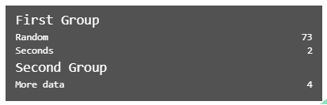

## Overview

Custom statistics based on custom events, output in the same style as A-Frame stats.

### stats-panel

An optional component.  This is required to add custom stats if the A-Frame `stats` component might not be present on the scene.

If the A-Frame `stats` component *is* present on the scene, this can be used with `merge: false` to separate the custom stats into a separate panel in the bottom left corner.

| Property | Description                                                  | Default |
| -------- | ------------------------------------------------------------ | ------- |
| merge    | If an A-Frame stats panel is present, should the additional stats be merged into it?  If "true", they are appended at the end.  If "false", the additional stats are shown in a new panel in the bottom left corner of the screen. | false   |

### stats-group

Used to group stats rows.  Every `stats-row` must be in a `stats-group`, referencing it by name if there is more than one.

The name of the `stats-group` is specified in the component name: the part that appears after the `__` in the component name is the group name.

| Property | Description                                                  | Default |
| -------- | ------------------------------------------------------------ | ------- |
| label    | The label for this stats group - displayed in the stats panel. | blank   |

### stats-row

A row of data to be displayed in a stats table.

The source of data for a row is always an event, with some properties in its `detail`

| Property   | Description                                                  | Default |
| ---------- | ------------------------------------------------------------ | ------- |
| group      | Every statistics row must be displayed in a group.<br />This component uses this name to search for a group to add the row to.  It searches for:<br />- a group with a matching name on the same entity<br />- a group with a matching name on the scene<br />- any unnamed group on the entity<br />- any unnamed group on the scene., |         |
| event      | The name of the event that provides data for this stats row.  Each time the event is detected, the stats row will be updated with data from the event.  Note that the `stats-row` must be configured on an entity that will detect the event. |         |
| properties | The names of one or more properties within the `detail` of the event that is to be displayed in the `stats-row`.  These are displayed without any additional formatting.  If additional formatting / processing is required, write an additional component that listens for the event and modifies the data as required.  If multiple properties are specified, they are displayed left-right.  Typically 3-4 data items can be fitted into a row, if required. |         |
| label      | The label for this stats row - displayed in the stats panel. |         |


## Installation

```
<script src="https://cdn.jsdelivr.net/gh/diarmidmackenzie/aframe-examples@latest/components/stats-panel/index.min.js"></script>
```


Or from npm:

https://www.npmjs.com/package/aframe-stats-panel


## Examples

Here's an example of `stats-panel` components set on an `a-scene` to display 3 additional stats rows, in 2 groups.

```
    <a-scene stats
        stats-panel="merge: false"
        stats-group__1="label: First Group"
        stats-group__2="label: Second Group"
        stats-row__1="group: 1; event: event1; property: secs; label: Seconds"
        stats-row__2="group: 1; event: event1; property: random; label: Random"
        stats-row__3="group: 2; event: event2; property: data; label: More data"
        generate-data>
```

With suitable events generating input, this will generate output like this:



See a live example here: [stats-panel.html](https://diarmidmackenzie.github.io/aframe-examples/component-usage/stats-panel.html)

## Code

  [stats-panel.js](https://github.com/diarmidmackenzie/aframe-examples/blob/main/components/stats-panel/index.js)